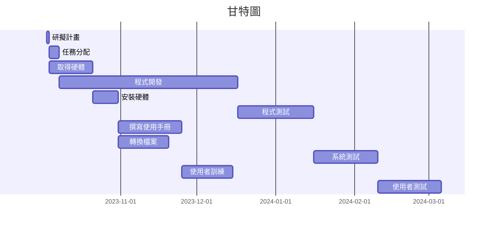
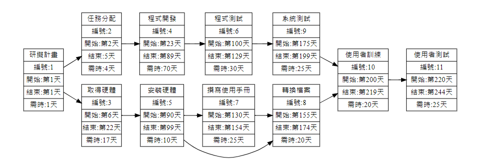

## CShape.java        
abstract class CShape{
    protected String color;
    public void setColor(String str){
        color = str;
    }

    public abstract void show();
}

           
## CTriangle.java
class CTriangle extends CShape{
    double ca, cb, cc;
    public CTriangle(double a, double b, double c){
        ca=a;
        cb=b;
        cc=c;
    }
   
    public void show() {
       
        System.out.print("color="+color+"  ");
        System.out.print("area="+0.5*ca*cb);
    }
   
}

## app11.java
public class app11 {
   public static void main(String[] args) {
    CTriangle ct = new CTriangle(3, 4, 5);
    ct.setColor("red");
    ct.show();
}
}

---

# 專案管理

## 甘特圖
## 甘特圖

## PERT/CPM圖

## 關鍵路徑
1-> 2-> 4-> 6-> 9-> 10-> 11
